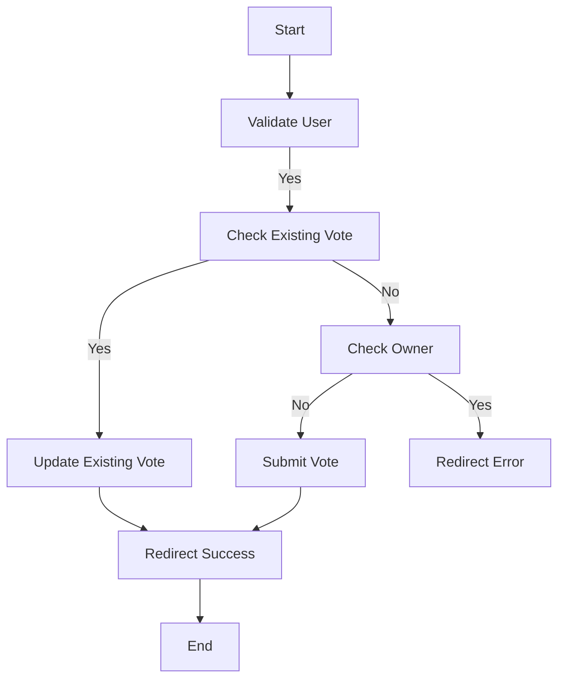

# VoiceController
## Sistem Architecture

## Database Structure
- Question
  - id
  - user_id
  - content
- Voice
  - id
  - user_id
  - question_id
  - value
## Endpoint
- GET /api/questions: Mendapatkan daftar pertanyaan.
- GET /api/voices: Mendapatkan daftar voices
- POST /api/voice/{question}: Memberikan suara pada pertanyaan tertentu.
